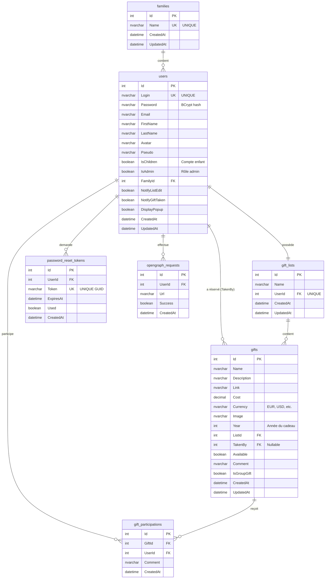

# Diagramme ERD - Base de Données Nawel

## Vue d'Ensemble

Ce diagramme représente le schéma complet de la base de données Nawel avec toutes les tables et leurs relations.

## Diagramme Mermaid



## Légende

| Symbole | Signification |
|---------|---------------|
| `PK` | Primary Key (Clé primaire) |
| `FK` | Foreign Key (Clé étrangère) |
| `UK` | Unique Key (Contrainte d'unicité) |
| `||--o{` | Relation 1 vers N (one-to-many) |
| `||--||` | Relation 1 vers 1 (one-to-one) |

## Relations Détaillées

### families → users (1:N)

- **Type** : One-to-Many
- **Cardinalité** : Une famille contient plusieurs utilisateurs
- **Clé étrangère** : `users.FamilyId` → `families.Id`
- **Delete** : RESTRICT (ne peut pas supprimer famille avec users)
- **Logique** : Tous les membres d'une famille peuvent voir les listes des autres membres

### users → gift_lists (1:1)

- **Type** : One-to-One
- **Cardinalité** : Un utilisateur possède exactement une liste de cadeaux
- **Clé étrangère** : `gift_lists.UserId` → `users.Id` (UNIQUE)
- **Delete** : CASCADE (supprime la liste si user supprimé)
- **Logique** : Créée automatiquement lors de la création d'un utilisateur

### gift_lists → gifts (1:N)

- **Type** : One-to-Many
- **Cardinalité** : Une liste contient plusieurs cadeaux
- **Clé étrangère** : `gifts.ListId` → `gift_lists.Id`
- **Delete** : CASCADE (supprime tous les cadeaux si liste supprimée)
- **Logique** : Les cadeaux sont filtrés par année (`Year`)

### users → gifts [TakenBy] (1:N)

- **Type** : One-to-Many (optional)
- **Cardinalité** : Un utilisateur peut réserver plusieurs cadeaux
- **Clé étrangère** : `gifts.TakenBy` → `users.Id` (nullable)
- **Delete** : SET NULL (libère le cadeau si user supprimé)
- **Logique** : `TakenBy` renseigné uniquement pour cadeaux classiques, pas pour cadeaux groupés

### gifts → gift_participations (1:N)

- **Type** : One-to-Many
- **Cardinalité** : Un cadeau groupé peut avoir plusieurs participants
- **Clé étrangère** : `gift_participations.GiftId` → `gifts.Id`
- **Delete** : CASCADE (supprime participations si cadeau supprimé)
- **Logique** : Utilisé uniquement si `gifts.IsGroupGift = TRUE`

### users → gift_participations (1:N)

- **Type** : One-to-Many
- **Cardinalité** : Un utilisateur peut participer à plusieurs cadeaux groupés
- **Clé étrangère** : `gift_participations.UserId` → `users.Id`
- **Delete** : CASCADE (supprime participations si user supprimé)
- **Contrainte** : UNIQUE (`GiftId`, `UserId`) - un user ne peut participer qu'une fois au même cadeau

### users → password_reset_tokens (1:N)

- **Type** : One-to-Many
- **Cardinalité** : Un utilisateur peut avoir plusieurs tokens de reset (historique)
- **Clé étrangère** : `password_reset_tokens.UserId` → `users.Id`
- **Delete** : CASCADE (supprime tokens si user supprimé)
- **Logique** : Tokens éphémères, expiration 24h, usage unique

### users → opengraph_requests (1:N)

- **Type** : One-to-Many
- **Cardinalité** : Un utilisateur peut effectuer plusieurs requêtes OpenGraph
- **Clé étrangère** : `opengraph_requests.UserId` → `users.Id`
- **Delete** : CASCADE (supprime historique si user supprimé)
- **Logique** : Tracking pour monitoring et statistiques admin

## Contraintes d'Intégrité

### Contraintes UNIQUE

| Table | Colonne(s) | Raison |
|-------|-----------|---------|
| `families` | `Name` | Pas de doublons de noms de famille |
| `users` | `Login` | Login unique pour authentification |
| `gift_lists` | `UserId` | Une seule liste par utilisateur |
| `gift_participations` | (`GiftId`, `UserId`) | Un user ne peut participer qu'une fois |
| `password_reset_tokens` | `Token` | Token unique pour sécurité |

### Indexes

Pour optimiser les performances, les indexes suivants sont créés automatiquement :

| Table | Colonne(s) | Type | Utilisation |
|-------|-----------|------|-------------|
| `families` | `Name` | UNIQUE | Recherche par nom |
| `users` | `Login` | UNIQUE | Authentification |
| `users` | `FamilyId` | INDEX | Requêtes familiales |
| `gift_lists` | `UserId` | UNIQUE | Récupération liste user |
| `gifts` | `ListId` | INDEX | Cadeaux d'une liste |
| `gifts` | `Year` | INDEX | Filtrage par année |
| `gifts` | `TakenBy` | INDEX | Panier utilisateur |
| `gift_participations` | (`GiftId`, `UserId`) | UNIQUE | Participation unique |
| `gift_participations` | `GiftId` | INDEX | Comptage participants |
| `password_reset_tokens` | `Token` | UNIQUE | Validation rapide |
| `opengraph_requests` | `CreatedAt` | INDEX | Stats par période |

## Cas d'Usage

### Cas 1 : Afficher les Listes d'une Famille

```sql
SELECT u.FirstName, u.LastName, l.Name AS ListName, COUNT(g.Id) AS GiftCount
FROM families f
INNER JOIN users u ON u.FamilyId = f.Id
INNER JOIN gift_lists l ON l.UserId = u.Id
LEFT JOIN gifts g ON g.ListId = l.Id AND g.Year = 2025
WHERE f.Id = 1
GROUP BY u.Id, u.FirstName, u.LastName, l.Name
ORDER BY u.FirstName;
```

### Cas 2 : Panier de Réservations d'un Utilisateur

```sql
-- Cadeaux classiques réservés
SELECT
    g.Id,
    g.Name,
    g.Cost,
    u_owner.FirstName AS OwnerFirstName,
    u_owner.LastName AS OwnerLastName
FROM gifts g
INNER JOIN gift_lists l ON l.Id = g.ListId
INNER JOIN users u_owner ON u_owner.Id = l.UserId
WHERE g.TakenBy = 5 AND g.Year = 2025

UNION ALL

-- Cadeaux groupés participés
SELECT
    g.Id,
    g.Name,
    g.Cost,
    u_owner.FirstName AS OwnerFirstName,
    u_owner.LastName AS OwnerLastName
FROM gift_participations gp
INNER JOIN gifts g ON g.Id = gp.GiftId
INNER JOIN gift_lists l ON l.Id = g.ListId
INNER JOIN users u_owner ON u_owner.Id = l.UserId
WHERE gp.UserId = 5 AND g.Year = 2025;
```

### Cas 3 : Statistiques d'un Cadeau Groupé

```sql
SELECT
    g.Name,
    g.Cost,
    COUNT(gp.Id) AS ParticipantCount,
    GROUP_CONCAT(u.FirstName SEPARATOR ', ') AS Participants
FROM gifts g
LEFT JOIN gift_participations gp ON gp.GiftId = g.Id
LEFT JOIN users u ON u.Id = gp.UserId
WHERE g.Id = 124
GROUP BY g.Id, g.Name, g.Cost;
```

### Cas 4 : Migrations MD5 en Attente

```sql
-- Utilisateurs avec mot de passe MD5 (32 chars, pas BCrypt)
SELECT
    u.Id,
    u.Login,
    u.Email,
    u.FirstName,
    u.LastName,
    LENGTH(u.Password) AS PasswordLength
FROM users u
WHERE LENGTH(u.Password) = 32
  AND u.Password NOT LIKE '$2%'
  AND u.Email IS NOT NULL
ORDER BY u.CreatedAt DESC;
```

### Cas 5 : Dashboard Admin - Stats API OpenGraph

```sql
-- Requêtes OpenGraph par mois (12 derniers mois)
SELECT
    YEAR(CreatedAt) AS Year,
    MONTH(CreatedAt) AS Month,
    COUNT(*) AS TotalRequests,
    SUM(CASE WHEN Success = TRUE THEN 1 ELSE 0 END) AS SuccessCount,
    ROUND(100.0 * SUM(CASE WHEN Success = TRUE THEN 1 ELSE 0 END) / COUNT(*), 2) AS SuccessRate
FROM opengraph_requests
WHERE CreatedAt >= DATE_SUB(NOW(), INTERVAL 12 MONTH)
GROUP BY YEAR(CreatedAt), MONTH(CreatedAt)
ORDER BY Year DESC, Month DESC;
```

## Évolution du Schéma

### Futures Améliorations Possibles

1. **Table `notifications`** :
   - Historique de toutes les notifications envoyées
   - Statut (envoyé, échec, rebond)
   - Permettrait un centre de notifications dans l'app

2. **Table `gift_images`** :
   - Support de plusieurs images par cadeau
   - Relation 1:N avec `gifts`

3. **Table `comments`** :
   - Commentaires sur les cadeaux
   - Discussions entre utilisateurs

4. **Table `wish_priority`** :
   - Priorité des cadeaux (haute, moyenne, basse)
   - Enum ou table dédiée

5. **Table `categories`** :
   - Catégorisation des cadeaux (électronique, vêtements, livres, etc.)
   - Facilite la recherche et les filtres

### Migration Vers ces Évolutions

```bash
# Exemple : Ajouter table notifications
dotnet ef migrations add AddNotificationsTable
dotnet ef database update
```

## Optimisations Futures

### Si Volume Important

1. **Partitionnement par Année** :
   - Table `gifts` partitionnée par `Year`
   - Améliore performance des requêtes filtrées par année

2. **Archivage** :
   - Déplacer les cadeaux anciens (> 3 ans) vers table d'archivage
   - Garde la table principale légère

3. **Cache Redis** :
   - Mettre en cache les listes fréquemment consultées
   - TTL de quelques minutes

4. **Read Replicas** :
   - Séparer lectures (listes, cadeaux) et écritures (réservations)
   - Load balancing des requêtes SELECT

## Outils de Visualisation

### Générer le Diagramme

Ce diagramme Mermaid peut être visualisé dans :

1. **GitHub / GitLab** : Rendu automatique des blocs Mermaid
2. **Visual Studio Code** : Extension "Markdown Preview Mermaid Support"
3. **Online** : [Mermaid Live Editor](https://mermaid.live/)
4. **Documentation** : Confluence, Notion supportent Mermaid

### Outils Alternatifs

Pour des diagrammes plus complexes ou des présentations :

- **dbdiagram.io** : Générateur ERD en ligne (syntaxe simple)
- **draw.io** : Diagrammes manuels (PNG/SVG exportable)
- **MySQL Workbench** : Reverse engineering depuis DB existante
- **DBeaver** : ER Diagram intégré

## Références

- [Mermaid ERD Syntax](https://mermaid.js.org/syntax/entityRelationshipDiagram.html)
- [Database Normalization](https://en.wikipedia.org/wiki/Database_normalization)
- [MySQL Foreign Keys](https://dev.mysql.com/doc/refman/8.0/en/create-table-foreign-keys.html)
