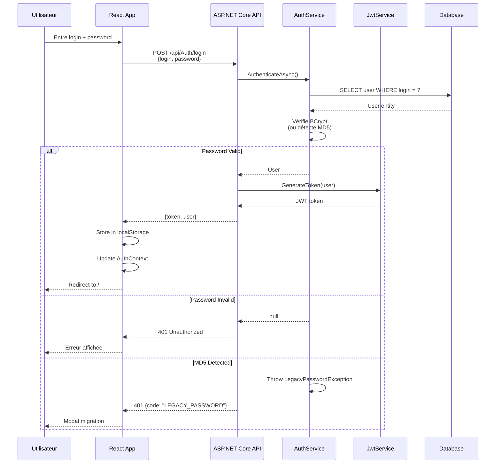
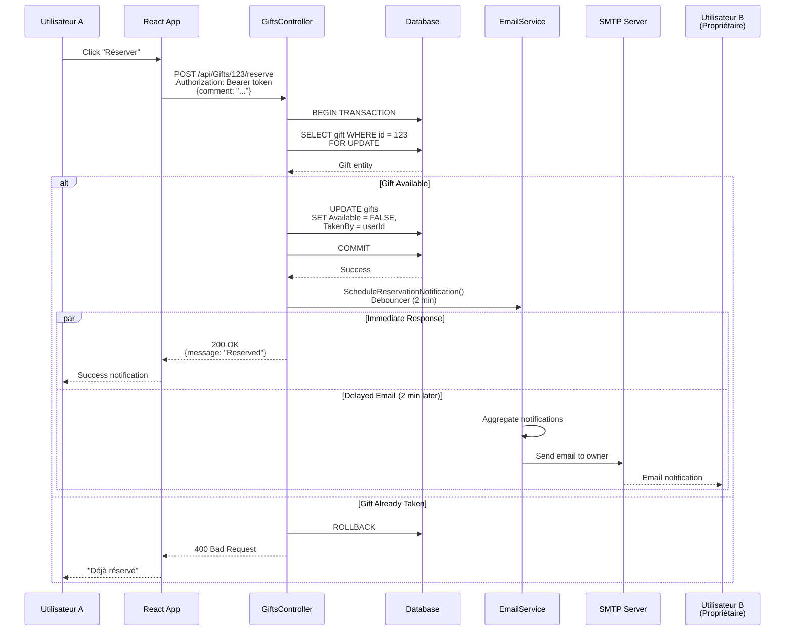
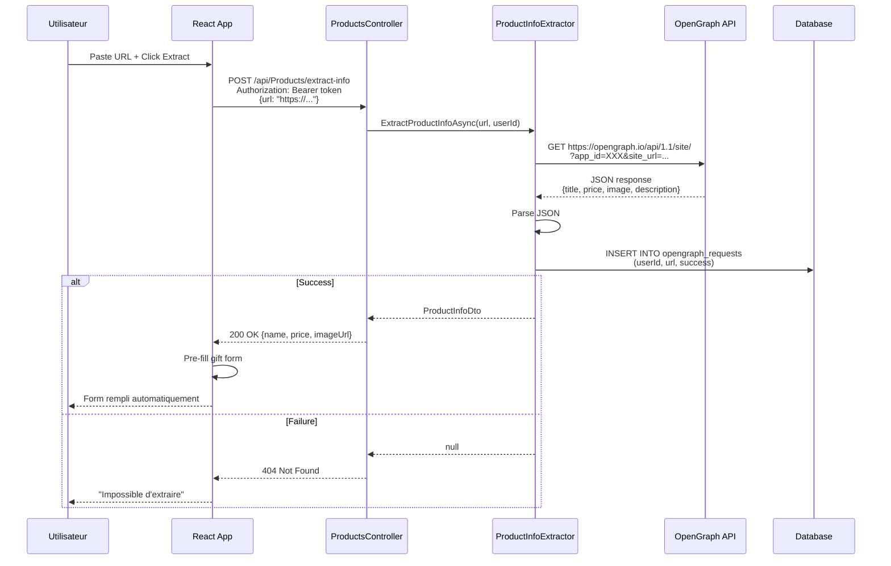
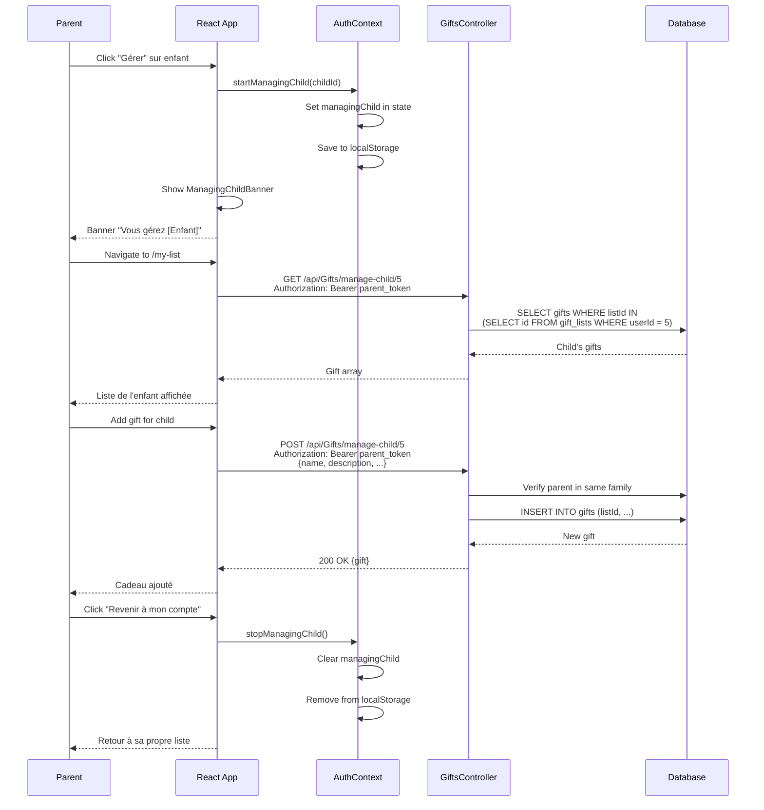
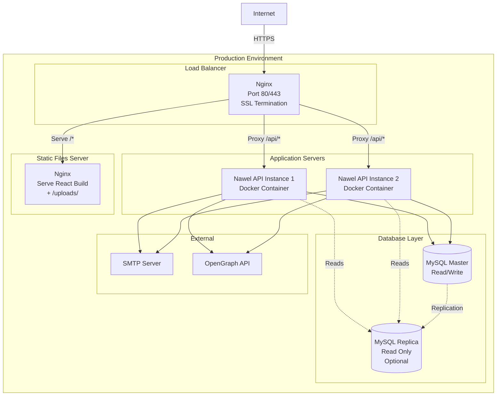
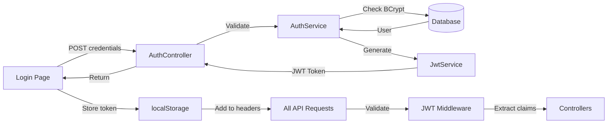

# Diagramme d'Architecture Système - Nawel

## Vue d'Ensemble

Ce diagramme présente l'architecture complète de l'application Nawel, incluant le frontend React, le backend ASP.NET Core, la base de données, et les services externes.

## Architecture Globale

```mermaid
graph TB
    subgraph "Client"
        Browser[Navigateur Web<br/>Chrome, Firefox, Safari]
    end

    subgraph "Frontend - React App"
        ReactApp[React 19.2 + TypeScript<br/>Vite 7.2<br/>Port 3000]
        AuthContext[AuthContext<br/>State Management]
        Router[React Router 7.10<br/>Navigation]
        MUI[Material-UI 7.3<br/>Components]
        ApiService[API Service<br/>Axios + Interceptors]
    end

    subgraph "Reverse Proxy (Optionnel)"
        Nginx[Nginx<br/>HTTPS + Load Balancing]
    end

    subgraph "Backend - ASP.NET Core API"
        API[ASP.NET Core 9.0<br/>Port 5000]

        subgraph "Middleware Pipeline"
            ExHandler[Exception Handler]
            Swagger[Swagger UI<br/>/swagger]
            RateLimit[Rate Limiting<br/>AspNetCoreRateLimit]
            CORS[CORS Policy]
            Auth[JWT Authentication]
            Authz[Authorization]
        end

        subgraph "Controllers"
            AuthCtrl[AuthController]
            AdminCtrl[AdminController]
            UsersCtrl[UsersController]
            ListsCtrl[ListsController]
            GiftsCtrl[GiftsController]
            ProductsCtrl[ProductsController]
        end

        subgraph "Services"
            AuthSvc[AuthService<br/>Login + BCrypt]
            JwtSvc[JwtService<br/>Token Generation]
            EmailSvc[EmailService<br/>MailKit + Debouncing]
            ProductSvc[ProductInfoExtractor<br/>OpenGraph Integration]
        end

        subgraph "Data Layer"
            EFCore[Entity Framework Core 9.0<br/>NawelDbContext]
        end
    end

    subgraph "Storage"
        Uploads[File System<br/>uploads/avatars/]
    end

    subgraph "Database"
        MySQL[(MySQL 8.0<br/>Production)]
        SQLite[(SQLite<br/>Development)]
    end

    subgraph "External Services"
        SMTP[SMTP Server<br/>Email Delivery<br/>Port 587/TLS]
        OpenGraph[OpenGraph API<br/>opengraph.io<br/>Product Metadata]
    end

    %% Connections
    Browser -->|HTTPS| ReactApp
    ReactApp -->|State| AuthContext
    ReactApp -->|Routing| Router
    ReactApp -->|UI| MUI
    ReactApp -->|HTTP REST| ApiService

    ApiService -->|HTTPS<br/>Optional| Nginx
    Nginx -.->|Proxy| API
    ApiService -->|HTTP| API

    API --> ExHandler
    ExHandler --> Swagger
    Swagger --> RateLimit
    RateLimit --> CORS
    CORS --> Auth
    Auth --> Authz
    Authz --> AuthCtrl
    Authz --> AdminCtrl
    Authz --> UsersCtrl
    Authz --> ListsCtrl
    Authz --> GiftsCtrl
    Authz --> ProductsCtrl

    AuthCtrl --> AuthSvc
    AuthCtrl --> JwtSvc
    AuthCtrl --> EmailSvc
    UsersCtrl --> AuthSvc
    UsersCtrl --> Uploads
    GiftsCtrl --> EmailSvc
    ProductsCtrl --> ProductSvc

    AuthSvc --> EFCore
    EmailSvc --> SMTP
    ProductSvc --> OpenGraph
    ProductSvc --> EFCore

    EFCore -->|Production| MySQL
    EFCore -->|Development| SQLite

    style Browser fill:#e1f5ff
    style ReactApp fill:#61dafb
    style API fill:#512bd4
    style MySQL fill:#4479a1
    style SQLite fill:#003b57
    style SMTP fill:#ffa500
    style OpenGraph fill:#00d084
```



## Flux de Données Principaux

### 1. Flux d'Authentification



### 2. Flux de Réservation de Cadeau



### 3. Flux d'Extraction de Produit (OpenGraph)



### 4. Flux de Gestion Enfant (Parent)



## Composants Détaillés

### Frontend - React App

**Technologies** :
- React 19.2 + TypeScript 5.9
- Vite 7.2 (build + dev server)
- Material-UI 7.3 (composants)
- React Router 7.10 (routing)
- Axios 1.13 (HTTP client)
- LESS 4.4 (styling)

**Structure** :
```
src/
├── components/      # Composants réutilisables
├── contexts/        # AuthContext (state global)
├── hooks/          # Custom hooks
├── pages/          # Composants pages (6 pages)
├── services/       # API calls (axios)
├── types/          # TypeScript interfaces
└── utils/          # Utilitaires
```

**Port par défaut** : 3000 (dev), configurable

**Build** :
```bash
npm run build  # Production build dans dist/
```

### Backend - ASP.NET Core API

**Technologies** :
- ASP.NET Core 9.0
- Entity Framework Core 9.0
- BCrypt.Net-Next 4.0.3
- MailKit 4.14.1
- Swashbuckle 10.0.1

**Port par défaut** : 5000 (HTTP), 5001 (HTTPS)

**Démarrage** :
```bash
dotnet run  # Development
dotnet run --configuration Release  # Production
```

### Base de Données

**MySQL 8.0 (Production)** :
- Port : 3306
- Charset : utf8mb4
- Collation : utf8mb4_unicode_ci
- Storage Engine : InnoDB

**SQLite (Development)** :
- Fichier : `nawel.db`
- Location : Racine du projet API
- Pas de serveur (embedded)

### Services Externes

**SMTP Server** :
- Port : 587 (STARTTLS) ou 465 (SSL)
- Protocole : MailKit via SMTP
- Utilisation : Notifications asynchrones avec debouncing

**OpenGraph API** :
- URL : `https://opengraph.io/api/1.1/site/`
- Authentification : API Key
- Rate Limit : Variable selon plan
- Utilisation : Extraction métadonnées produits

## Déploiement

### Architecture de Déploiement Recommandée



### Configuration Docker

**Frontend** :
```dockerfile
FROM node:20-alpine AS build
WORKDIR /app
COPY package*.json ./
RUN npm ci
COPY . .
RUN npm run build

FROM nginx:alpine
COPY --from=build /app/dist /usr/share/nginx/html
COPY nginx.conf /etc/nginx/nginx.conf
EXPOSE 80
CMD ["nginx", "-g", "daemon off;"]
```

**Backend** :
```dockerfile
FROM mcr.microsoft.com/dotnet/sdk:9.0 AS build
WORKDIR /src
COPY *.csproj ./
RUN dotnet restore
COPY . .
RUN dotnet publish -c Release -o /app/publish

FROM mcr.microsoft.com/dotnet/aspnet:9.0
WORKDIR /app
COPY --from=build /app/publish .
EXPOSE 8080
ENTRYPOINT ["dotnet", "Nawel.Api.dll"]
```

**Docker Compose** :
```yaml
version: '3.8'
services:
  mysql:
    image: mysql:8.0
    environment:
      MYSQL_ROOT_PASSWORD: ${MYSQL_ROOT_PASSWORD}
      MYSQL_DATABASE: nawel_db
    volumes:
      - mysql_data:/var/lib/mysql
    ports:
      - "3306:3306"

  api:
    build: ./backend/Nawel.Api
    environment:
      ConnectionStrings__DefaultConnection: "server=mysql;database=nawel_db;user=root;password=${MYSQL_ROOT_PASSWORD}"
      JWT_SECRET: ${JWT_SECRET}
    depends_on:
      - mysql
    ports:
      - "5000:8080"

  frontend:
    build: ./frontend/nawel-app
    ports:
      - "3000:80"
    depends_on:
      - api

volumes:
  mysql_data:
```

## Sécurité

### Authentification Flow



### Security Headers (Nginx)

```nginx
add_header X-Frame-Options "SAMEORIGIN" always;
add_header X-Content-Type-Options "nosniff" always;
add_header X-XSS-Protection "1; mode=block" always;
add_header Referrer-Policy "strict-origin-when-cross-origin" always;
add_header Content-Security-Policy "default-src 'self'; script-src 'self' 'unsafe-inline'; style-src 'self' 'unsafe-inline';" always;
```

### Rate Limiting

Configuration actuelle :
- **Login** : 5 tentatives / minute
- **Global** : 100 requêtes / 15 minutes
- **Par IP** : Compteur individuel

## Monitoring

### Métriques Clés

| Métrique | Seuil Critique | Action |
|----------|----------------|--------|
| API Response Time | > 500ms | Optimiser queries DB |
| CPU Usage | > 80% | Scale horizontal |
| Memory Usage | > 80% | Investiguer memory leaks |
| DB Connections | > 90% pool | Augmenter pool size |
| Error Rate | > 5% | Investiguer logs |
| Disk Space | < 10% libre | Nettoyer / agrandir |

### Logs

**Niveaux** :
- **Information** : Requêtes normales, login réussi
- **Warning** : Login échoué, token expiré
- **Error** : Exceptions, erreurs DB
- **Critical** : Service down, DB inaccessible

**Centralisation** :
- Serilog + Elasticsearch (recommandé)
- Ou fichiers + logrotate

## Performance

### Optimisations Implémentées

1. **Async/Await** : Toutes opérations I/O asynchrones
2. **Connection Pooling** : EF Core pool par défaut
3. **Static Files Caching** : Cache headers Nginx
4. **Debouncing Emails** : Agrégation 2 minutes
5. **Indexes DB** : Sur colonnes fréquemment recherchées

### Optimisations Futures

1. **Redis Cache** : Cache listes de cadeaux
2. **CDN** : Images et assets statiques
3. **Compression** : Gzip/Brotli (Nginx)
4. **Lazy Loading** : Composants React
5. **Query Optimization** : AsNoTracking() EF Core

## Scalabilité

### Scaling Horizontal (Recommandé)

- **API** : N instances derrière load balancer
- **Stateless** : JWT = pas de session serveur
- **Uploads** : Migrer vers S3/Azure Blob
- **DB** : Read replicas pour requêtes SELECT

### Scaling Vertical

- **API** : Augmenter CPU/RAM serveur
- **DB** : SSD plus rapides, plus de RAM
- **Limite** : Coûteux, single point of failure

## Références

- [ASP.NET Core Architecture](https://learn.microsoft.com/en-us/aspnet/core/fundamentals/)
- [React Best Practices](https://react.dev/learn)
- [Docker Multi-Stage Builds](https://docs.docker.com/build/building/multi-stage/)
- [Nginx Configuration](https://nginx.org/en/docs/)
- [Mermaid Documentation](https://mermaid.js.org/)
