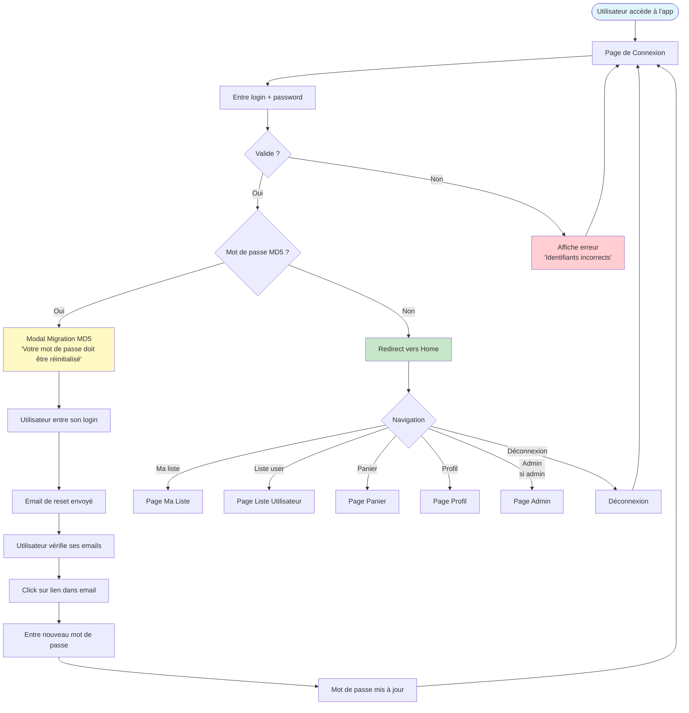
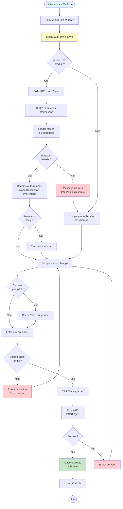
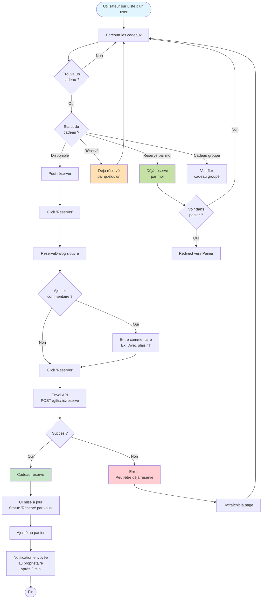
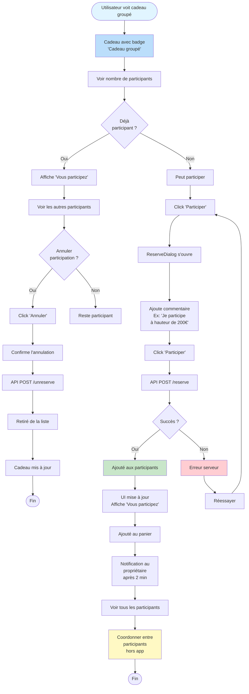
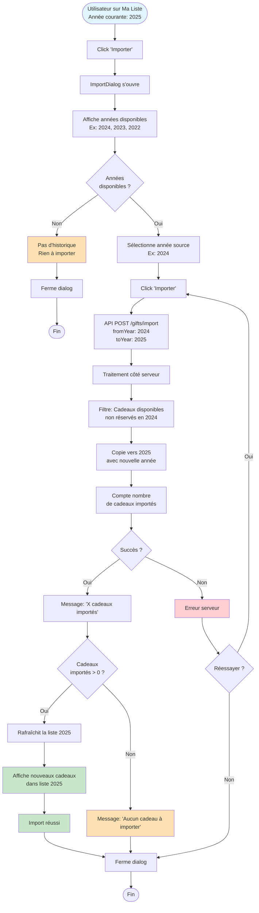
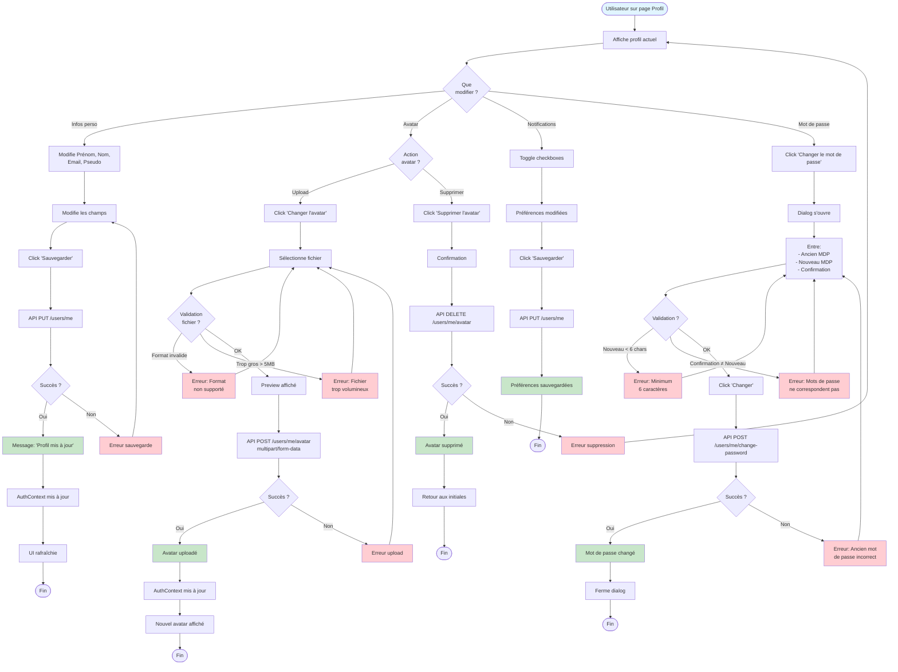
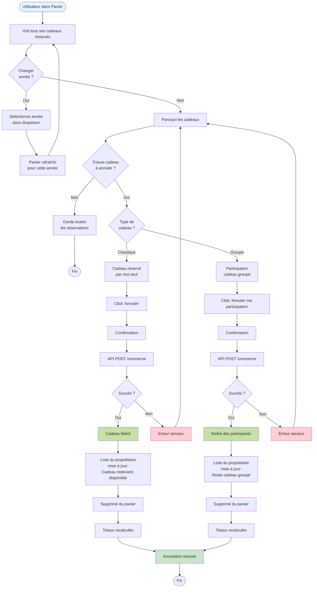

# Flux Utilisateurs - Nawel

## Vue d'Ensemble

Ce document contient les diagrammes de flux utilisateurs pour les parcours principaux de l'application Nawel.

---

## Table des Matières

1. [Connexion et Navigation](#connexion-et-navigation)
2. [Création de Cadeau](#création-de-cadeau)
3. [Réservation de Cadeau](#réservation-de-cadeau)
4. [Cadeau Groupé](#cadeau-groupé)
5. [Gestion Enfant](#gestion-enfant)
6. [Import de Cadeaux](#import-de-cadeaux)
7. [Gestion du Profil](#gestion-du-profil)

---

## Connexion et Navigation

### Flux de Connexion



---

## Création de Cadeau

### Flux Complet de Création



---

## Réservation de Cadeau

### Flux de Réservation Classique



---

## Cadeau Groupé

### Flux de Participation



---

## Gestion Enfant

### Flux de Gestion par Parent

```mermaid
flowchart TD
    Start([Parent sur page Home]) --> ViewFamily[Voit liste des familles]
    ViewFamily --> FindChild{Trouve son<br/>enfant ?}

    FindChild -->|Non| NoChild[Pas d'enfant<br/>dans la famille]
    FindChild -->|Oui| SeeChild[Enfant avec badge<br/>'Enfant']

    SeeChild --> ClickManage[Click 'Gérer']
    ClickManage --> Confirm[Confirmation]
    Confirm --> ModeActivated[Mode gestion activé]

    ModeActivated --> Banner[Banner jaune affiché<br/>'Vous gérez la liste de [Nom]']
    Banner --> Redirect[Redirect vers Ma Liste]
    Redirect --> ShowChildList[Liste de l'enfant affichée]

    ShowChildList --> Actions{Action<br/>souhaitée ?}

    Actions -->|Ajouter| AddGift[Click 'Ajouter un cadeau']
    Actions -->|Modifier| EditGift[Click 'Modifier' sur cadeau]
    Actions -->|Supprimer| DeleteGift[Click 'Supprimer' sur cadeau]
    Actions -->|Importer| ImportGift[Click 'Importer']
    Actions -->|Terminer| ExitMode

    AddGift --> GiftForm1[Formulaire création]
    EditGift --> GiftForm2[Formulaire édition]
    DeleteGift --> ConfirmDelete[Confirmation suppression]
    ImportGift --> ImportDialog[Dialog import année]

    GiftForm1 --> SaveGift1[Sauvegarde]
    GiftForm2 --> SaveGift2[Sauvegarde]
    ConfirmDelete --> DeleteAction[Suppression]
    ImportDialog --> ImportAction[Import]

    SaveGift1 --> NotifyChild1{Notif<br/>activée ?}
    SaveGift2 --> NotifyChild2{Notif<br/>activée ?}
    DeleteAction --> NotifyChild3{Notif<br/>activée ?}

    NotifyChild1 -->|Oui| EmailChild1[Email à l'enfant<br/>'Liste modifiée']
    NotifyChild1 -->|Non| UpdateList1
    NotifyChild2 -->|Oui| EmailChild2[Email à l'enfant<br/>'Liste modifiée']
    NotifyChild2 -->|Non| UpdateList1
    NotifyChild3 -->|Oui| EmailChild3[Email à l'enfant<br/>'Liste modifiée']
    NotifyChild3 -->|Non| UpdateList1

    EmailChild1 --> UpdateList1[Liste enfant mise à jour]
    EmailChild2 --> UpdateList1
    EmailChild3 --> UpdateList1
    ImportAction --> UpdateList1

    UpdateList1 --> ShowChildList

    ExitMode[Click 'Revenir à mon compte'] --> ModeDeactivated[Mode gestion désactivé]
    ModeDeactivated --> BannerHidden[Banner disparaît]
    BannerHidden --> RedirectMyList[Redirect vers Ma Liste]
    RedirectMyList --> ShowMyList[Ma propre liste affichée]
    ShowMyList --> End([Fin])

    NoChild --> End

    style Start fill:#e1f5ff
    style ModeActivated fill:#fff9c4
    style Banner fill:#fff59d
    style EmailChild1 fill:#e1bee7
    style EmailChild2 fill:#e1bee7
    style EmailChild3 fill:#e1bee7
    style ShowMyList fill:#c8e6c9
```

---

## Import de Cadeaux

### Flux d'Import depuis Année Précédente



---

## Gestion du Profil

### Flux de Modification du Profil



---

## Annulation de Réservation

### Flux d'Annulation depuis Panier



---

## Récapitulatif des Flux

| Flux | Complexité | Pages Impliquées | Durée Estimée |
|------|------------|------------------|---------------|
| **Connexion** | Simple | Login, Home | 30 sec - 2 min |
| **Création Cadeau** | Moyenne | MyList | 1-3 min |
| **Réservation** | Simple | UserList, Cart | 30 sec - 1 min |
| **Cadeau Groupé** | Moyenne | UserList, Cart | 1-2 min |
| **Gestion Enfant** | Complexe | Home, MyList | 5-10 min |
| **Import Cadeaux** | Simple | MyList | 30 sec - 1 min |
| **Profil** | Moyenne | Profile | 2-5 min |
| **Annulation** | Simple | Cart, UserList | 30 sec |

---

## Légende des Diagrammes

### Formes

- **Rectangle arrondi** (Start/End) : Point d'entrée/sortie
- **Rectangle** : Action/Processus
- **Losange** : Décision/Condition
- **Parallélogramme** : Données/Input

### Couleurs

- 🔵 **Bleu clair** (`#e1f5ff`) : Points de départ
- 🟢 **Vert** (`#c8e6c9`) : Succès/Complétion
- 🔴 **Rouge** (`#ffcdd2`) : Erreurs
- 🟡 **Jaune** (`#fff9c4`) : Avertissements/States spéciaux
- 🟠 **Orange** (`#ffe0b2`) : États neutres

---

## Notes d'Implémentation

Ces diagrammes de flux représentent le comportement idéal de l'application. En cas de divergence entre le comportement réel et ces diagrammes, considérez :

1. **Bugs potentiels** : Si l'app se comporte différemment, c'est peut-être un bug
2. **Évolutions** : Ces flux peuvent être mis à jour lors de nouvelles fonctionnalités
3. **Cas d'usage non couverts** : Certains cas limites peuvent ne pas être représentés

---

## Références

- [Guide de Démarrage](../user-guide/GETTING-STARTED.md)
- [Guide des Fonctionnalités](../user-guide/FEATURES.md)
- [Architecture Système](system-architecture.md)
- [Mermaid Documentation](https://mermaid.js.org/syntax/flowchart.html)
